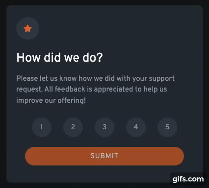

  

# Frontend Mentor - Interactive rating component solution

This is a solution to the [Interactive rating component challenge on Frontend Mentor](https://www.frontendmentor.io/challenges/interactive-rating-component-koxpeBUmI). Frontend Mentor challenges help you improve your coding skills by building realistic projects.

## Table of contents

- [Overview](#overview)
  - [The challenge](#the-challenge)
  - [Links](#links)
- [My process](#my-process)
  - [Built with](#built-with)
  - [What I learned](#what-i-learned)

## Overview

### The challenge

Users should be able to:

- View the optimal layout for the app depending on their device's screen size
- See hover states for all interactive elements on the page
- Select and submit a number rating
- See the "Thank you" card state after submitting a rating

### Links

- [My Solution to the Challenge](https://www.frontendmentor.io/solutions/interactive-rating-tool-using-semantic-html-sass-and-typescript-ruu_9x9TMN)
- [Live site](https://interactive-rating-tool.netlify.app/)

## My process

### Built with

- Semantic HTML5 markup
- Sass
- TypeScript

### What I learned

This is my first project using Sass and TypeScript (albeit in fairly moderate amounts). I want to keep using these techniques in future projects.
